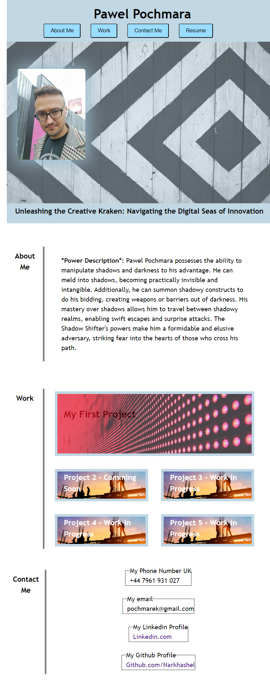

# Porfolio - Pawel Pochmara

## Description 

It's a second week of my FrontEnd WEb Development Bootcam. This week Project suposed to be a simple porfolio, based on which, we will hone our skills and aplly techniques we had learned so far. 

With time I hope I would turn this little and messsy app into something more worht of a professional webdeveloper, to really show off my skill set and to prove that even someone with zero experience, with enough dedication can learn soemthing as complex as this. 

### [Porfolio Link](https://narkhashel.github.io/Pawel-Pochmara-Portfolio/)

## Acceptance Criteria

Here are the critical requirements necessary to develop a portfolio that satisfies a typical hiring manager’s needs:

* When the page is loaded the page presents your name, a recent photo or avatar, and links to sections about you, your work, and how to contact you
* When one of the links in the navigation is clicked then the UI scrolls to the corresponding section
* When viewing the section about your work then the section contains titled images of your applications
* When presented with the your first application then that application's image should be larger in size than the others
* When images of the applications are clicked then the user is taken to that deployed application
* When the page is resized or viewed on various screens and devices then the layout is responsive and adapts to my viewport

The following animation shows the mock-up application's appearance and functionality, which we suposed to match our portfolio for this challenge. We were allowed to use our own collors and photos.

## Installation

N/A

## Credits

I used various material to help to finalise this projects. Mostly I based my concepts on the previous projects we work on during this past two weeks. AS well when doing reaserch on varius points, I took liberty to use ideas I stumble upon in my code as well. 

Here are links to websites I used the most:

* [W3-Schools](https://www.w3schools.com/) a lot of small tips and few exercises to help me understand better.
* [Flexbox](https://css-tricks.com/) I really did strugle with this part, but website deliverd solid explenation of the basic use of a flexbox.

## License

MIT License

## Features

N/A

## Tests

Not at the moment, but it's something I would like to add with time. 

